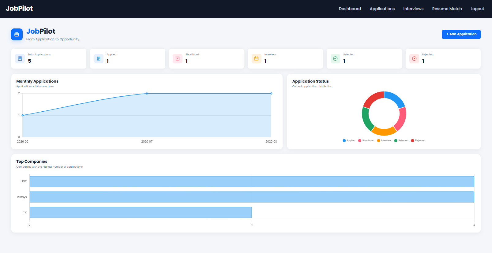
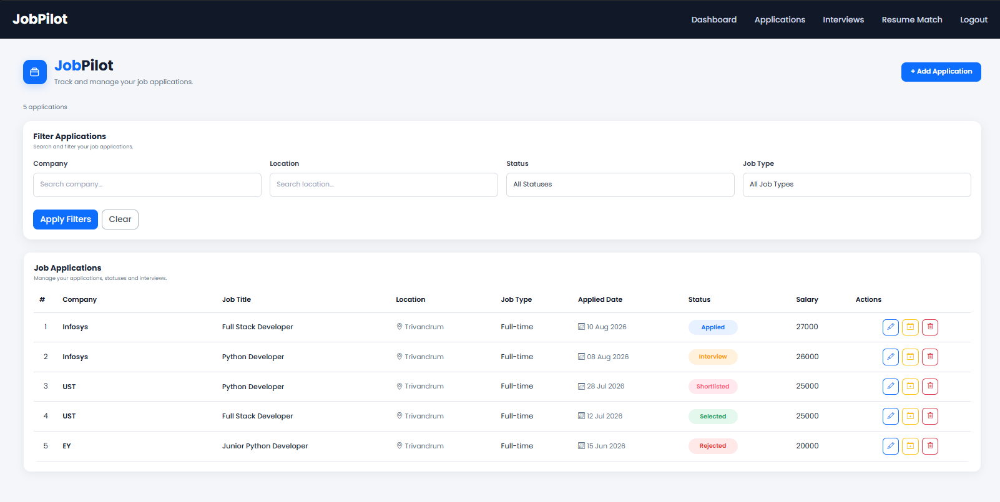
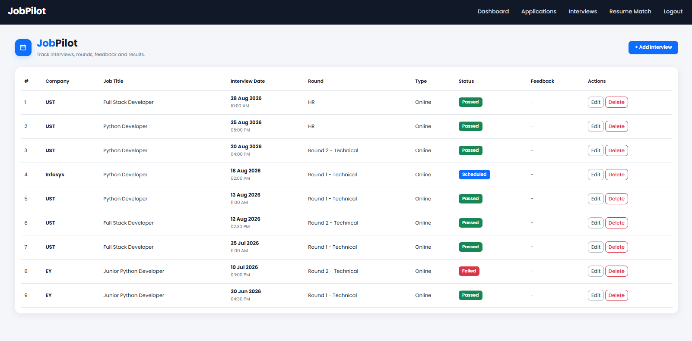
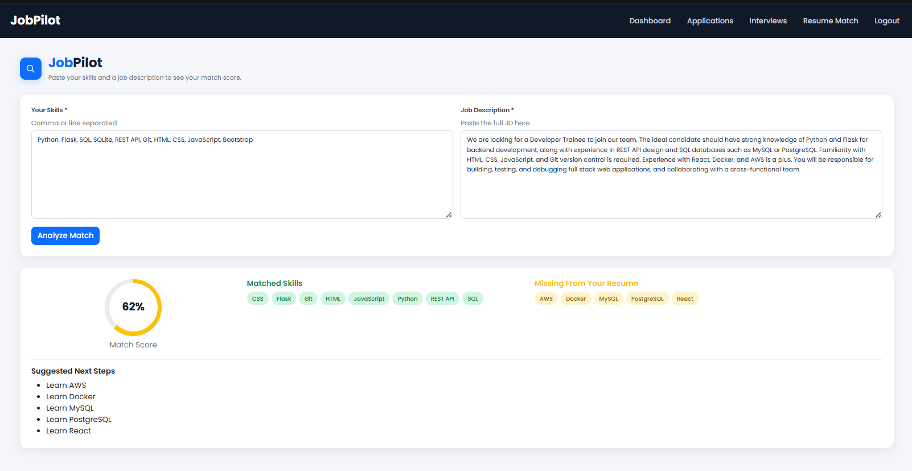
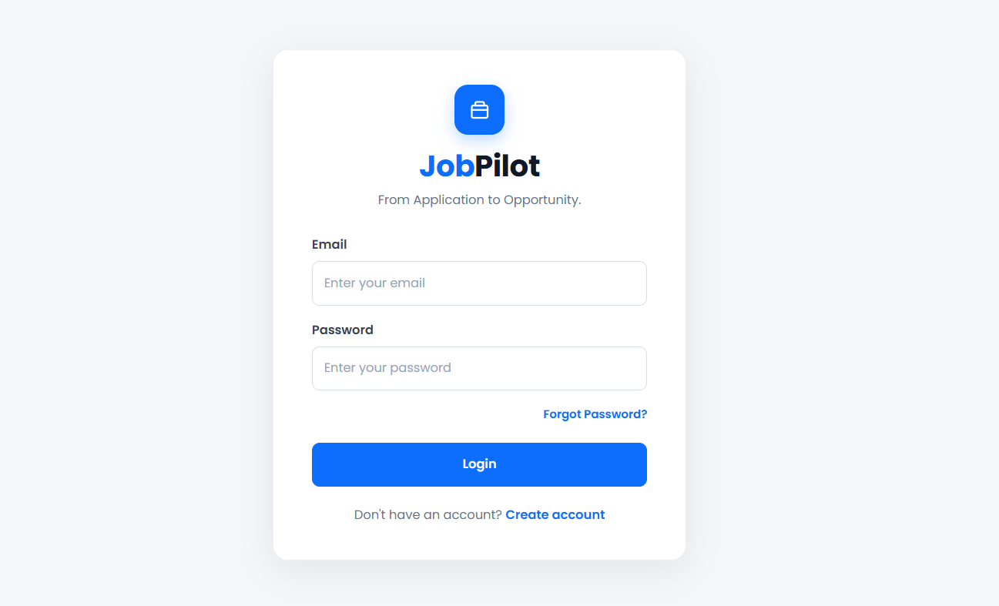

# 💼 JobPilot — Job Application & Interview Tracker

Full-stack web app to track job applications end-to-end — from the first application to the final offer — with an AI-powered resume/JD match feature and secure OTP-based authentication.

**From Application to Opportunity.**

🔗 **Live Demo:** _add your deployed link here after deploying_


## 📌 Problem Statement

Job hunting usually means juggling dozens of applications across spreadsheets, emails, and sticky notes — losing track of interview rounds, follow-ups, and what to prepare next. JobPilot centralizes the entire job search into one dashboard: track every application's status, log interview feedback, see analytics on your search activity, and check how well your skills match a job description before you apply.


## 🛠️ Tools & Skills

- **Backend** — Python, Flask, Flask-SQLAlchemy, Flask-Login

- **Database** — SQLite

- **API** — REST API (GET / POST / PUT / DELETE)

- **Frontend** — HTML, CSS, JavaScript, Bootstrap, Chart.js

- **Auth & Security** — Password hashing (Werkzeug), OTP email verification, environment-based secrets (`python-dotenv`)

- **Other** — Git & GitHub, Postman (API testing)


## 📁 Project Structure

```text
JobPilot/

│
├── app.py                    # Flask app: routes, models, REST API, OTP/email logic
├── requirements.txt
├── .env                       # Local secrets (not committed)
├── .gitignore
│
├── screenshots/
│   ├── dashboard.png
│   ├── applications.png
│   ├── interviews.png
│   └── resume-match.png
│
├── templates/
│   ├── base.html
│   ├── dashboard.html
│   ├── jobs.html
│   ├── job_form.html
│   ├── interviews.html
│   ├── interview_form.html
│   ├── resume_match.html
│   ├── login.html
│   ├── register.html
│   ├── forgot_password.html
│   ├── verify_otp.html
│   ├── reset_password.html
│   ├── 404.html
│   └── 500.html
│
└── static/
    ├── css/style.css
    └── js/app.js
```


## ✨ Key Features

### 🔐 Authentication

- Register / Login / Logout with hashed passwords

- Forgot Password → 6-digit OTP emailed to the user → verify → reset (OTP is hashed in-session and expires after 5 minutes)

- Live username/email availability check while typing on the register page


### 📊 Dashboard


- Total applications and a pipeline view: Applied → Shortlisted → Interview → Selected / Rejected
- Monthly application activity chart, status distribution donut chart, and top-companies bar chart


### 📋 Applications (CRUD)

- Company, title, location, job type, applied date, job URL, salary, status, notes
- Search & filter by company, location, status, and job type


### 🗓️ Interview Tracker


- Log rounds per job: date, time, round, type, status, feedback

- The job's overall status auto-updates from interview outcomes — e.g. all rounds "Passed" → job marked "Selected"; any round "Failed" → job marked "Rejected"


### 🤖 AI Resume ↔ Job Description Match


- Paste your skills and a job description

- Get a match score, matched skills, missing skills, and a suggested learning list — computed locally, no external API needed


### 🔌 REST API


- Full CRUD for jobs and interviews, scoped per logged-in user

- Tested with Postman


## 🖥️ Screenshots


### Dashboard




### Applications




### Interview Tracker




### AI Resume Match




### Login


## 🚀 How to Run

### Clone the repository


```bash

git clone https://github.com/Krishnapriya-S-G/JobPilot.git

cd JobPilot

```


### Set up the Python environment


```bash

python -m venv venv

venv\Scripts\activate

pip install -r requirements.txt

```

### Configure environment variables

Create a `.env` file in the project root:

```text

MAIL_USERNAME=your_gmail_address@gmail.com

MAIL_PASSWORD=your_gmail_app_password

SECRET_KEY=some-random-secret-string

```

`MAIL_PASSWORD` must be a [Gmail App Password](https://myaccount.google.com/apppasswords) (requires 2-Step Verification), not your regular Gmail password. This account only *sends* OTP emails — each user receives their OTP at their own registered email.


### Run the app


```bash

python app.py

```

Open **http://127.0.0.1:5000** — the database and tables are created automatically on first run. You'll be redirected to `/register` to create your first account.


## 🗄️ Database Schema


| Table | Key columns |

|---|---|

| **users** | id, username, email, password (hashed) |

| **jobs** | id, user_id (FK), company, title, location, job_type, applied_date, job_url, salary, status, notes |

| **interviews** | id, job_id (FK), interview_date, round, interview_type, status, feedback |


## 🔌 REST API Reference

All endpoints require an authenticated session and return JSON.


### Jobs


| Method | Endpoint | Description |

|---|---|---|

| GET | `/api/jobs` | List jobs (filter by `company`, `location`, `status`, `job_type`) |

| GET | `/api/jobs/<id>` | Get a single job |

| POST | `/api/jobs` | Create a job |

| PUT | `/api/jobs/<id>` | Update a job |

| DELETE | `/api/jobs/<id>` | Delete a job |


### Interviews


| Method | Endpoint | Description |

|---|---|---|

| GET | `/api/interviews` | List interviews |

| GET | `/api/interviews/<id>` | Get a single interview |

| POST | `/api/interviews` | Add an interview round |

| PUT | `/api/interviews/<id>` | Update an interview |

| DELETE | `/api/interviews/<id>` | Delete an interview |


### AI Resume Match


| Method | Endpoint | Description |

|---|---|---|

| POST | `/api/resume-match` | `{"resume_skills": "...", "job_description": "..."}` → match score + suggestions |


### Utility


| Method | Endpoint | Description |

|---|---|---|

| GET | `/api/check-username` | `?username=...` → availability check |

| GET | `/api/check-email` | `?email=...` → availability check |


## 🔒 Security Notes


- Passwords are hashed with Werkzeug's `generate_password_hash` — never stored in plain text.

- OTPs are hashed (SHA-256) before being stored in the session and expire after 5 minutes.

- Email credentials and the Flask secret key are loaded from environment variables via `.env` (excluded from version control), not hardcoded.


## 👤 Author


**Krishnapriya S G **

 [LinkedIn](https://www.linkedin.com/in/krishnapriya-s-g)

